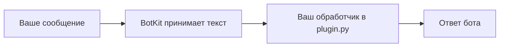

# BotKit: каркас текстового Telegram-бота

BotKit создаёт папку для своего текстового бота с настройками и обработчиком сообщений. Встроенные шаблоны можно проверить локально без Telegram и токена; затем подключить собственного бота через Telegram Bot API. Приветствие меняется в настройках, а логику ответов пишут в `Plugin.on_text` самостоятельно или с помощью ИИ. Для функций сложнее текстового ответа могут понадобиться дополнительный код и зависимости.

В каркасе нет данных, настроек и работающих функций действующего TT Parser. Шаблон `tt-links` разбирает присланный текст как URL: если схема — HTTPS, а домен относится к TikTok или YouTube, он возвращает одну и ту же демо-фразу. Он не проверяет существование ролика, не извлекает ссылку из предложения, не загружает видео и не выполняет распознавание или анализ.



## Первый запуск на Windows без Telegram

Нужен установленный Python 3.11 или новее с `pip`. Скачайте репозиторий через **Code → Download ZIP** на GitHub, распакуйте его и откройте PowerShell в папке с `pyproject.toml`. Выполните команды по порядку:

```powershell
python -m venv .venv
.\.venv\Scripts\python.exe -m pip install -e .
.\.venv\Scripts\python.exe -m botkit new mybot --dest .
.\.venv\Scripts\python.exe -m botkit demo --config .\mybot\bot.toml --text "Привет"
```

Первая команда создаёт отдельную среду Python, вторая устанавливает BotKit, третья создаёт папку `mybot`, четвёртая показывает ответ на `/start` и ваш пробный текст. Установка может потребовать интернет для сборочных зависимостей. Встроенные шаблоны и подменённый Telegram-транспорт после установки не требуют сети, аккаунта Telegram, VPS или платной модели. Пользовательский `plugin.py` запускается и в деморежиме как обычный код: он может обращаться к сети и файлам.

Установка через `pip install -e .` привязана к папке с исходниками BotKit: после установки не удаляйте и не перемещайте её. Папка созданного бота не является отдельным готовым приложением; на другом компьютере понадобятся Python и установленный BotKit.

Чтобы увидеть пример с ссылкой на видео:

```powershell
.\.venv\Scripts\python.exe -m botkit new links_demo --dest . --template tt-links
.\.venv\Scripts\python.exe -m botkit demo --config .\links_demo\bot.toml --text "https://youtu.be/example"
```

Каждый бот хранится в своей папке:

- `bot.toml` — название, приветствие, запасной ответ, имя переменной для токена и время ожидания Telegram.
- `plugin.py` — метод `Plugin.on_text`. Здесь меняют поведение бота. Шаблон `echo` повторяет текст, а `tt-links` проверяет схему и домен присланного URL.
- `.env.example` — образец файла для токена. Настоящий `.env` создаёт владелец; он исключён из Git.

ИИ можно дать задание «измени только `Plugin.on_text` в `plugin.py`, чтобы бот отвечал на вопрос о расписании». Не передавайте ИИ токен, файл `.env` или данные пользователей. Для произвольной новой функции всё равно потребуется код в этом методе; каркас убирает повторяющуюся настройку, а не создаёт любую бизнес-логику автоматически.

## Подключить своего бота Telegram

1. Создайте бота через BotFather и получите его токен.
2. В папке созданного бота скопируйте `.env.example` в `.env`. Замените заглушку своим токеном. Не публикуйте `.env` и не вставляйте токен в чат с ИИ.
3. Из папки с исходниками BotKit запустите `.\.venv\Scripts\python.exe -m botkit run --config .\mybot\bot.toml`. Остановить работу можно клавишами Ctrl+C. Бот работает, пока запущен процесс, включён компьютер и доступен интернет; автостарт и хостинг не включены.

Вместо `.env` можно задать переменную окружения, указанную в `[telegram].token_env`. Команда `run` использует [Telegram Bot API](https://core.telegram.org/bots/api): `getUpdates` для получения новых сообщений и `sendMessage` для текстового ответа. Она работает через стандартную библиотеку Python, без отдельной Telegram-библиотеки. Если для этого бота уже настроен webhook, сначала отключите его: Telegram не отдаёт обновления через long polling при активном webhook.

Если сообщение `Telegram API unavailable; retrying shortly.` повторяется, проверьте, что заглушка токена заменена, есть доступ к Telegram и отключён webhook. Сейчас команда не различает эти причины ошибки.

## Границы каркаса

- Принимаются только текстовые сообщения. `/start` встроен; `Plugin.on_text` возвращает один обычный текст без HTML/Markdown.
- Если обработчик ошибся или вернул недопустимый ответ, бот отправляет `fallback_message` из `bot.toml` и продолжает принимать сообщения. Приветствие и запасной ответ ограничены 4096 символами.
- В базовом пакете нет базы данных, очереди, обработки медиа, ИИ, платежей, админ-панели, ограничения частоты сообщений или хостинга. Их можно добавлять как отдельные модули, когда они нужны конкретному боту.
- Позиция чтения Telegram хранится в памяти. После перезапуска возможно повторное получение сообщения, если ответ уже отправился, а следующее чтение ещё не подтвердило обновление. Для рабочего сервиса нужны постоянное хранение позиции и защита от повторов.
- `plugin.py` — выполняемый код без изоляции. Проверяйте изменения ИИ до запуска даже в деморежиме, особенно перед запуском с настоящим токеном.
- Реальный Telegram и работа под нагрузкой в этой версии не проверялись. Тесты используют только подменённый транспорт.

## Проверки и лицензия

```powershell
.\.venv\Scripts\python.exe -m unittest discover -s tests -v
```

Каркас распространяется под [MIT](LICENSE). Свой токен настраивайте только у себя.

Код написан OpenAI Codex по постановке владельца; владелец ставил задачи, проверял и принимал работу.

**English:** This Python 3.11+ starter scaffolds text-only Telegram bots with a local fake-transport demo and a long-polling adapter. Built-in templates need no token or network to demo after installation; custom plugins execute normally and may access the network or local files. The TT-link sample only checks HTTPS hostnames and does not process media. Live Telegram use has not been tested.
