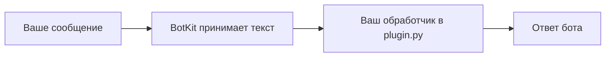

# BotKit: каркас Telegram-бота

Это каркас для создания своего текстового бота. Сначала он работает на компьютере без Telegram и токена: вы отправляете ему пробный текст и видите ответ. Затем можно подключить собственного бота Telegram. Приветствие меняется в настройках; для нового поведения заполняют один метод в `plugin.py` самостоятельно или с помощью ИИ.

В каркасе нет данных и настроек действующего TT Parser. Шаблон `tt-links` **только распознаёт ссылку** TikTok или YouTube и честно отвечает, что загрузка видео, распознавание речи и анализ не подключены.



## Первый запуск на Windows без Telegram

Нужен Python 3.11 или новее. Откройте PowerShell в этой папке и выполните команды по порядку:

```powershell
python -m pip install -e .
botkit new mybot --dest .
botkit demo --config .\mybot\bot.toml --text "Привет"
```

Первая команда устанавливает каркас локально. Вторая создаёт папку `mybot` с настройками и местом для вашей логики. Третья показывает ответ на `/start` и ваш пробный текст без сети, аккаунта Telegram, VPS или платной модели. Вместо `botkit` можно писать `python -m botkit`.

Чтобы увидеть пример с ссылкой на видео:

```powershell
botkit new links_demo --dest . --template tt-links
botkit demo --config .\links_demo\bot.toml --text "https://youtu.be/example"
```

Каждый бот хранится в своей папке:

- `bot.toml` — название, приветствие, запасной ответ, имя переменной для токена и время ожидания Telegram.
- `plugin.py` — метод `Plugin.on_text`. Здесь меняют поведение бота. В шаблоне `echo` он повторяет текст, а в `tt-links` распознаёт только тип ссылки.
- `.env.example` — образец файла для токена. Настоящий `.env` создаёт владелец; он исключён из Git.

ИИ можно дать задание «измени только `Plugin.on_text` в `plugin.py`, чтобы бот отвечал на вопрос о расписании». Не передавайте ИИ токен, файл `.env` или данные пользователей. Для произвольной новой функции всё равно потребуется код в этом методе; каркас убирает повторяющуюся настройку, а не создаёт любую бизнес-логику автоматически.

## Подключить своего бота Telegram

1. Создайте бота через BotFather и получите его токен.
2. В папке созданного бота скопируйте `.env.example` в `.env`. Замените заглушку своим токеном. Не публикуйте `.env` и не вставляйте токен в чат с ИИ.
3. Запустите `botkit run --config .\mybot\bot.toml`. Остановить работу можно клавишами Ctrl+C.

Вместо `.env` можно задать переменную окружения, указанную в `[telegram].token_env`. Команда `run` использует [Telegram Bot API](https://core.telegram.org/bots/api): `getUpdates` для получения новых сообщений и `sendMessage` для текстового ответа. Она работает через стандартную библиотеку Python, без отдельной Telegram-библиотеки. Если для этого бота уже настроен webhook, сначала отключите его: Telegram не отдаёт обновления через long polling при активном webhook.

## Границы каркаса

- Принимаются только текстовые сообщения. `/start` встроен; `Plugin.on_text` возвращает один обычный текст без HTML/Markdown.
- Если обработчик ошибся или вернул недопустимый ответ, бот отправляет `fallback_message` из `bot.toml` и продолжает принимать сообщения. Приветствие и запасной ответ ограничены 4096 символами.
- В базовом пакете нет базы данных, очереди, обработки медиа, ИИ, платежей, админ-панели, ограничения частоты сообщений или хостинга. Их можно добавлять как отдельные модули, когда они нужны конкретному боту.
- Позиция чтения Telegram хранится в памяти. После перезапуска возможно повторное получение сообщения, если ответ уже отправился, а следующее чтение ещё не подтвердило обновление. Для рабочего сервиса нужны постоянное хранение позиции и защита от повторов.
- `plugin.py` — выполняемый код. Проверяйте изменения ИИ до запуска с настоящим токеном.
- Реальный Telegram и работа под нагрузкой в этой версии не проверялись. Тесты используют только подменённый транспорт.

## Проверки и лицензия

```powershell
python -m unittest discover -s tests -v
```

Каркас распространяется под [MIT](LICENSE). Свой токен настраивайте только у себя.

Код написан OpenAI Codex по постановке владельца; владелец ставил задачи, проверял и принимал работу.

**English:** This Python starter creates configurable text bots for Telegram. The offline demo and project generator need no token or network. The TT link template recognizes URLs and does not download or analyze media.
